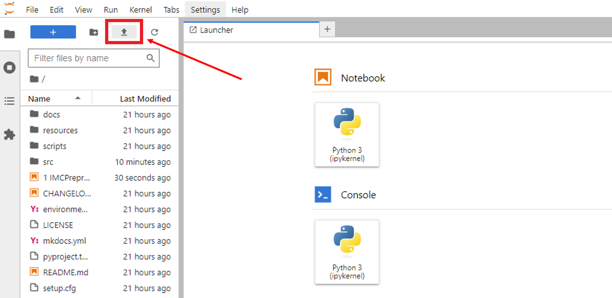

# Pre-R IMC Pipeline Documentation
## 1. Preprocessing and setting up a `conda` environment

Anaconda is a program used to install packages needed for many steps of the pipeline to run. Follow the steps below to set up Anaconda and a `conda` environment:

**Step 1:** Install [**Anaconda** ](https://www.anaconda.com/download)  
**Step 2:** Once Anaconda is installed, navigate to the relevant command line interface:

| Windows                                                                                            | macOS                                                                                                      |
|----------------------------------------------------------------------------------------------------|------------------------------------------------------------------------------------------------------------|
| 1. Search for **'Anaconda Prompt'** in the taskbar search   2. Select **Anaconda Prompt**    | 1. Use `cmd + space` to open Spotlight Search    2. Type **'Terminal'** and press `return` to open   |
    
**Step 3:** Enter the following commands (just copy and **`Ctrl + v`** into the terminal):

~~~~sh
git clone --recursive https://github.com/BodenmillerGroup/ImcSegmentationPipeline.git
cd ImcSegmentationPipeline
conda env create -f environment.yml
conda activate imcsegpipe
pip install jupyterlab
~~~~

The `imcsegpipe` conda environment has now been **set up**! To begin on the first step of the pipeline, copy the following commands into the terminal to **activate** this new environment:
~~~~sh
conda activate imcsegpipe
jupyter lab
~~~~

This will automatically open a Jupyter instance at `http://localhost:8888/lab` in your browser. Upload the `1 IMCPreprocessing.ipynb` file using the upload button: 

  

From there, follow the instructions in the notebook file.

## 2. Generate images for Cellpose using ImageJ

Open the ImageJ script `2 ExtractForCellPose.ijm` and **change all required variables** there before running it: 

INSERT IMAGE

This script will generate image stacks containing 2 channels, 1 for the cell nuclei (in **blue**) and 1 for the rest of the cell body (in **green**). The cell body channel is generated by taking an 'Average Intensity' projection of all the channels labelled `1` in the 'Segment' column of `panel.csv`. The full images are saved under ‘analysis/cellpose’, and a random 200 x 200 crop is also saved in ‘analysis/cropped_images’ to train your segmentation model with. 

## 3a. Installing and opening Cellpose

Open **Anaconda Prompt** and run the following commands to install Cellpose:
~~~~sh
conda create -n cellpose pytorch=1.8.2 cudatoolkit=10.2 -c pytorch-lts
conda activate cellpose
python -m pip install cellpose[gui]
~~~~

To **open** Cellpose (both now and in the future), run the following commands:
~~~~sh
conda activate cellpose
python -m cellpose
~~~~

## 3b. Using the Cellpose GUI

**Note:** The steps below were written based on the **Cellpose 3** GUI - newer versions may differ slightly

1. Drag an image from the `cropped_images` folder into the GUI 
2. Click **Models** &rarr; **Add custom torch model to GUI** and select your custom model (in this case, the model used was titled `IFMasksOnIMCModel_HumanColon_TN3_CD12_FT1`)
3. Apply the settings below (if you wish to use different settings, you can read about them [here](https://cellpose.readthedocs.io/en/latest/settings.html)), and click `run` to run the segmentation:

  

4. After the model has finished running, you should see masks drawn around each of your segmented cells

If the model requires further tuning, then go to the section below on **‘Training a custom model’** - this will teach you how to build a model from scratch. Otherwise, if you are happy with the model's performance, skip to the section below on **Batch segmentation**.

## 3c. Training a custom model

TODO

## 3d. Batch segmentation

Once you are happy with the segmentation, run the following commands in **Anaconda Prompt**:
~~~~sh
conda activate cellpose
pip install jupyterlab
pip install chardet
pip install --upgrade charset-normalizer
pip install --upgrade requests jupyter
conda install -c anaconda numpy
conda install -c conda-forge scikit-image
conda install -c conda-forge matplotlib
jupyter lab
~~~~

Upload the `3 CellposeBatchSeg.ipynb` file using the upload button and follow the instructions in the notebook file.

## 4. Installing and using CellProfiler

**CellProfiler** is a tool we will use to calculate marker intensities and other metrics for each segmented cell. Install it from [here](https://cellprofiler.org/).

As part of the pipeline, we will be using some custom plugins for CellProfiler. Configure CellProfiler to use the plugins by following the steps below:
1. Open the CellProfiler GUI
2. Select **File** &rarr; **Preferences...**
3. Scroll down and set **CellProfiler plugins directory** to `path/to/ImcSegmentationPipeline/resources/ImcPluginsCP/plugins`
4. **Restart CellProfiler**

To use CellProfiler, open `4 MeasureMarkers.cpproj` and follow the steps below:
1. Drag and drop the `analysis/for_cellprofiler` folder into the CellProfiler `Images` window
2. Select **File** &rarr; **Preferences...** 
3. Set **Default Input Folder** to `analysis/CellProfilerOutput`
4. Click the `Analyze Images` button at the bottom of the screen and wait for CellProfiler to finish running

After CellProfiler has finished running, the following files will have been generated in the `analysis/CellProfilerOutput` folder:
- `cell.csv`: contains features (columns) for each cell (rows)
- `Experiment.csv`: contains metadata related to the CellProfiler version used
- `Image.csv`: contains image-level measurements (eg. channel intensities) and acquisition metadata
- `Object relationships.csv`: contains neighbour information in form of an edge list between cells

Now, you are ready to proceed to the `R` part of the pipeline by opening `5 Analysis.Rmd`!

