# Pre-R IMC Pipeline Documentation

### **Authors:** oscardong4@gmail.com and heeva.baharlou@gmail.com

## 1a. Preprocessing and setting up a `conda` environment

Anaconda is a program used to install packages needed for many steps of the pipeline to run. Follow the steps below to set up Anaconda and a `conda` environment:

**Step 1:** Install [**Anaconda** ](https://www.anaconda.com/download)  
**Step 2:** Once Anaconda is installed, navigate to the relevant command line interface:

| Windows                                                                                            | macOS                                                                                                      |
|----------------------------------------------------------------------------------------------------|------------------------------------------------------------------------------------------------------------|
| 1. Search for **'Anaconda Prompt'** in the taskbar search   2. Select **Anaconda Prompt**    | 1. Use `cmd + space` to open Spotlight Search    2. Type **'Terminal'** and press `return` to open   |

    
**Step 3:** Enter the following commands (make sure to run the lines **one at a time**):

~~~~sh
git clone --recursive https://github.com/BodenmillerGroup/ImcSegmentationPipeline.git
cd ImcSegmentationPipeline
git clone --recursive https://github.com/CVR-MucosalImmunology/IMC.git
conda env create -f environment.yml
conda activate imcsegpipe
pip uninstall tifffile
pip install tifffile==2024.8.10
pip install jupyterlab
~~~~

The `imcsegpipe` conda environment has now been **set up**! To begin on the first step of the pipeline, copy the following commands into the terminal to **activate** this new environment:
~~~~sh
conda activate imcsegpipe
jupyter lab
~~~~

This will automatically open a Jupyter instance at `http://localhost:8888/lab` in your browser. Upload the `1 IMCPreprocessing.ipynb` file using the upload button: 

  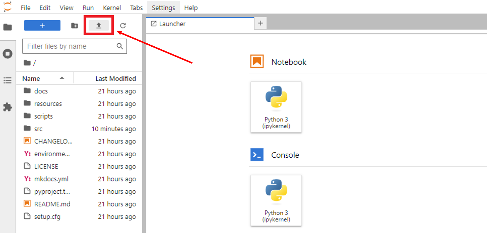

From there, follow the instructions in the notebook file.

## 1b. Removing outliers from images

Open the ImageJ script `1.5 RemoveOutliers.ijm` and **change all required variables** there before running it: 

  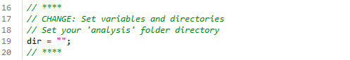

This script will use the `Remove Outliers...` function in ImageJ to remove any outlier pixels from each image channel. You can read more about the function [here](https://imagej.net/ij/docs/menus/process.html#:~:text=Remove%20Outliers,%2C%20i.e.%2C%20in%20pixels). 

The modified images are saved to the **same** `analysis/1c_full_images` folder, and will simply **replace** the old images. 

## 2. Generating images for Cellpose using ImageJ

Open the ImageJ script `2 ExtractForCellPose.ijm` and **change all required variables** there before running it: 

  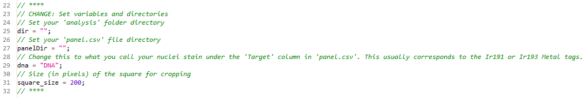

This script will generate image stacks containing 2 channels, 1 for the cell nuclei (in **blue**) and 1 for the rest of the cell body (in **green**). The cell body channel is generated by taking an 'Average Intensity' projection of all the channels labelled `1` in the 'Segment' column of `panel.csv`. 

The full images are saved under `analysis/2a_cellpose_full`, and a random cropped area is also saved in `analysis/2b_cropped_images` to train your segmentation model with. 

## 3a. Installing and opening Cellpose

Open **Anaconda Prompt** and run the following commands to install Cellpose:
~~~~sh
conda create -n cellpose pytorch=1.8.2 cudatoolkit=10.2 -c pytorch-lts
conda activate cellpose
python -m pip install cellpose[gui]
~~~~

To **open** Cellpose (both now and in the future), run the following commands:
~~~~sh
conda activate cellpose
python -m cellpose
~~~~

## 3b. Using the Cellpose GUI

**Note:** The steps below were written based on the **Cellpose 3** GUI - newer versions may differ slightly

1. Drag an image from the `2b_cropped_images` folder into the GUI 
2. Click **Models** &rarr; **Add custom torch model to GUI** and select your custom model (in this case, the model used was titled `IFMasksOnIMCModel_HumanColon_TN3_CD12_FT1`)
3. There are several settings available for you to change:

| GUI Setting | Description |
| -- | -- |
| diameter (pixels) | Approximate diameter of each cell - you can manually enter this, or press `calibrate` to let the model estimate it (the size is represented by a disk at the bottom left of the view window) |
| chan to segment | Colour channel containing the **cell body** - should be set to `2: green` |
| chan2 (optional) |  Colour channel containing the **cell nuclei** - should be set to `3: blue` |
| use GPU | Whether to use the GPU - should be **ticked** if possible to speed up segmentation |
| additional settings | You can read more about these settings (eg. `flow threshold`) [here](https://cellpose.readthedocs.io/en/latest/settings.html) |

4. Select your custom model under the `Other models` pane and click the `run` button next to it to start the segmentation:

  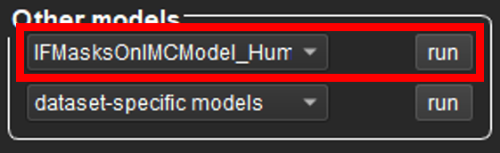

5. After the model has finished running, you should see masks drawn around each of your segmented cells:

  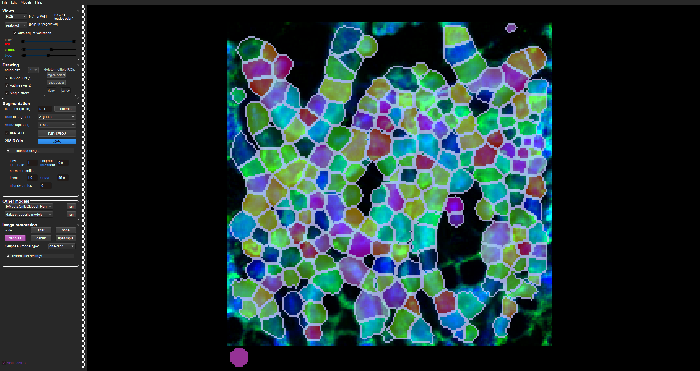

**Note:** you can toggle the coloured masks on and off by pressing `X` on your keyboard, and also the segmentation outlines by pressing `Z`.

If the model requires further tuning, then go to the section below on **‘Training a custom model’** - this will teach you how to build a model from scratch. Otherwise, if you are happy with the model's performance, skip straight to the **'Batch segmentation'** section.

## 3c. Training a custom Cellpose model

To train a custom Cellpose model, follow the steps below. There is also a YouTube video [here](https://www.youtube.com/watch?v=3Y1VKcxjNy4) that also demonstrates the process. 

1. Drag an image from the `2b_cropped_images` folder into the GUI
2. Ensure that your GUI settings are all configured appropriately (eg. your cell diameter is set correctly) - see the table in the section **'Using the Cellpose GUI'** above for help with this
3. Under the `Other models` pane, click the `dataset-specific models` button to bring up a drop-down menu of built-in Cellpose models
4. Test each of these models on your image by selecting them and pressing `run` (there is also the additional **cyto3** model you can run by pressing `run cyto3` next to the `use GPU` checkbox)

  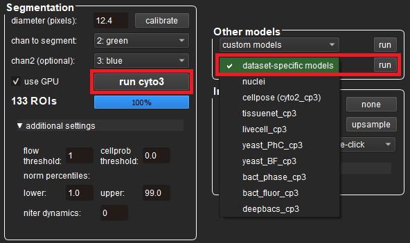

5. Select the pre-trained model that worked best for your image and run it again
6. Correct the segmentation results as you see fit by drawing new ROIs (`right-click`, draw and `right-click` again) and deleting incorrect ones (`Ctrl + left-click`) - remember to press `Ctrl + S` to save your changes
7. Press `Ctrl + T` to open up the interface for training a new model:

  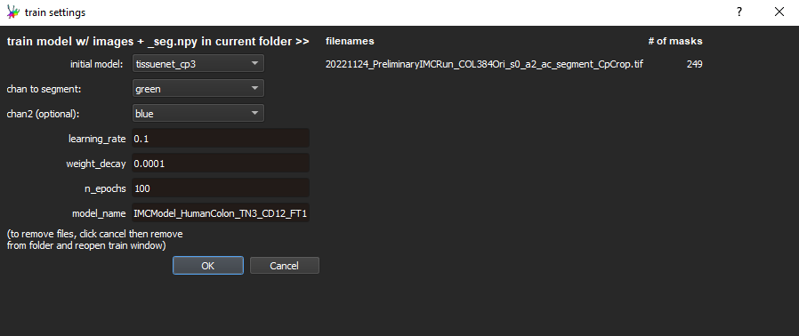

8. Set `initial model` to the pre-trained model you ran in **Step 5**, name your custom model and press `OK` (the default values for the other parameters should work well in most cases)
9. The model will train and then auto-run on the next image in the folder 
10. Repeat **Steps 6-9** until you are happy with the model's performance
11. The trained model is saved in a new `models` sub-folder within your `2b_cropped_images` folder, and will also appear in the GUI under the `Other models` pane (in the `custom models` drop-down menu)

**Note:** it is recommended you name your model in a systematic way to keep track of the settings you applied. Our model (`IFMasksOnIMCModel_HumanColon_TN3_CD12_FT1`) was named with special suffixes at the end to keep track of this information:
- **TN3:** the initial model used was **tissuenet_cp3** 
- **CD12:** the cell diameter was set to 12 pixels
- **FT1:** the flow threshold was set to 1

You are now ready to use the model for **'Batch segmentation'** in the next section.

## 3d. Batch segmentation

Once you are happy with the model's performance, run the following commands in **Anaconda Prompt**:
~~~~sh
conda activate cellpose
pip install jupyterlab
pip install chardet
pip install --upgrade charset-normalizer
pip install --upgrade requests jupyter
conda install -c anaconda numpy
conda install -c conda-forge scikit-image
conda install -c conda-forge matplotlib
jupyter lab
~~~~

Once again, this will automatically open a Jupyter instance at `http://localhost:8888/lab` in your browser. Upload the `3 CellposeBatchSeg.ipynb` file using the upload button and follow the instructions in the notebook file.

## 4. Generating compartment masks

For **epithelial segmentation**, open the ImageJ script `4 ExtractEpiMask.ijm` and **change all required variables** there before running it:

  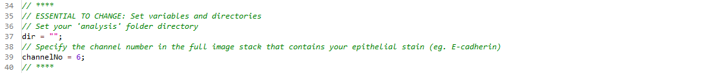

**Note:** there are also some *optional* variables you can change too if you wish:

  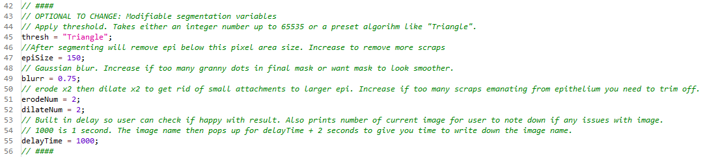

This script generates masks for epithelial areas in an image stack by:
1. **Extracting** a user-specified channel
2. **Normalising** it
3. **Applying** a user-defined threshold
4. **Filtering out** small particles
5. **Eroding** the mask to remove residual attachments to the epithelium
6. **Dilating** the mask

A delay is built into the macro to allow the user to visually check the results during processing and note down names of any 'trouble images' which require correction. All masks are saved to the existing `analysis/3b_for_cellprofiler` folder, with the suffix `_full_EP` at the end of the filename. 

To correct any 'trouble images', follow the steps below:
1. Open them and run **Invert LUT** from the task bar
2. Use one of the selection tools to outline areas for removal
3. Press the `Backspace` key to delete these areas, which will then become black (assigned a value of `0`)
4. Run **Invert LUT** again so the epithelium is black and the background is white (as shown below)
5. Save the image under the same filename it was originally saved to

  

## 5. Installing and using CellProfiler

**CellProfiler** is a tool we will use to calculate marker intensities and other metrics for each segmented cell. Install it from [here](https://cellprofiler.org/).

As part of the pipeline, we will be using some custom plugins for CellProfiler. Configure CellProfiler to use the plugins by following the steps below:
1. Open the CellProfiler GUI
2. Select **File** &rarr; **Preferences...**
3. Scroll down and set **CellProfiler plugins directory** to `path/to/ImcSegmentationPipeline/resources/ImcPluginsCP/plugins`
4. **Restart CellProfiler**

To use CellProfiler, open `5 MeasureMarkers.cpproj` and follow the steps below:
1. Drag and drop the `analysis/3b_for_cellprofiler` folder into the CellProfiler `Images` window:

  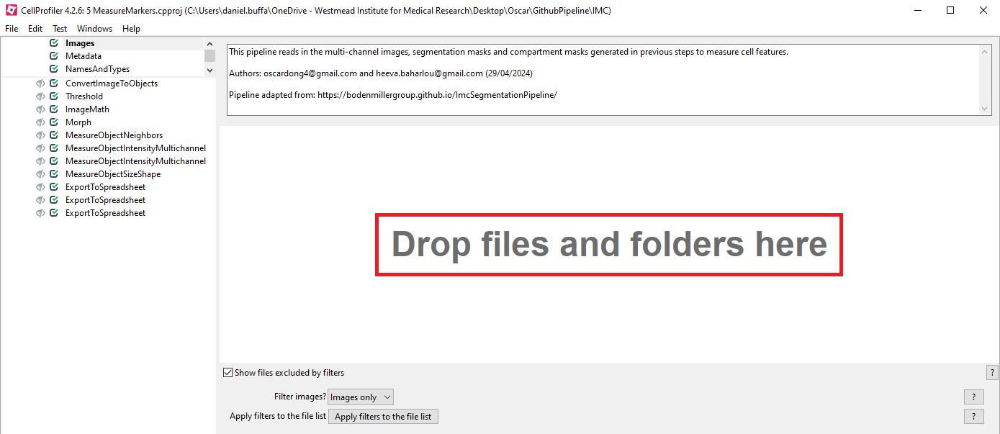

2. Select **File** &rarr; **Preferences...** 
3. Set **Default Output Folder** to `analysis/5_cellprofiler_output` and click `Save`
4. Click the **first** `MeasureMarkerIntensityMultichannel` module on the left hand side of the screen (the `FullStack` box in **Select images to measure** should be ticked), and set the number of channels in your full image stack:

  

5. Click the **first** `ExportToSpreadsheet` module on the left hand side of the screen, press the `Press button to select measurements` button, click **cell** &rarr; **Intensity** &rarr; **MeanIntensity** to open a series of drop-down menus, make sure the **3 boxes** below are **ALL** ticked, and click `OK`:

  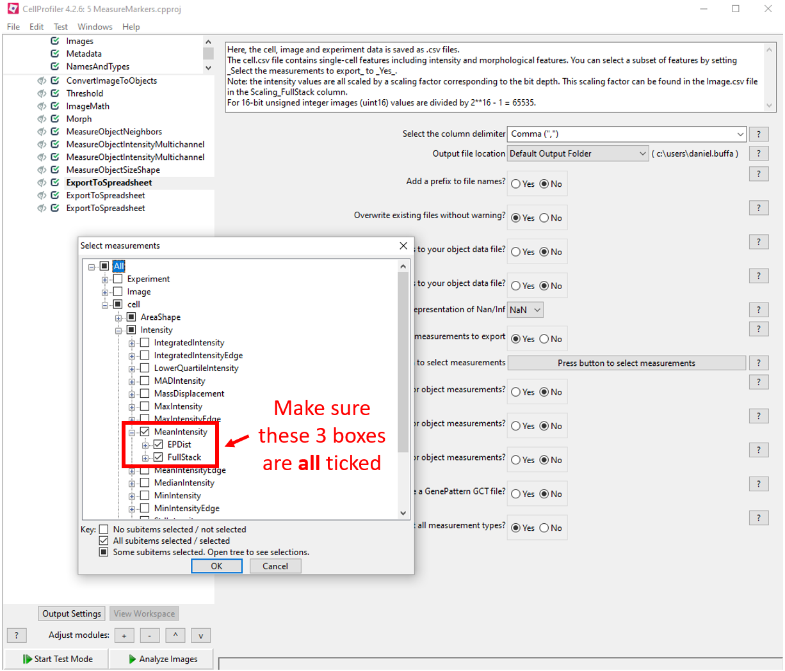

6. Click the `Analyze Images` button at the bottom of the screen and wait for CellProfiler to finish running

After CellProfiler has finished running, the following files will have been generated in the `analysis/5_cellprofiler_output` folder:
- `cell.csv`: contains features (columns) for each cell (rows)
- `Experiment.csv`: contains metadata related to the CellProfiler version used
- `Image.csv`: contains image-level measurements (eg. channel intensities) and acquisition metadata
- `Object relationships.csv`: contains neighbour information in form of an edge list between cells

Now, you are ready to proceed to the **`R`** part of the pipeline by opening `6 Analysis.Rmd`!
