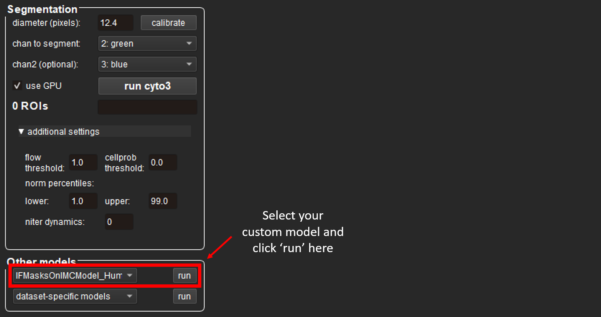

# Pre-R IMC Pipeline Documentation
## 1. Setting up a `conda` environment

Anaconda is a program used to install packages needed for many steps of the pipeline to run. Follow the steps below to set up Anaconda and a `conda` environment:

**Step 1:** Install [**Anaconda** ](https://www.anaconda.com/download)  
**Step 2:** Once Anaconda is installed, navigate to the relevant command line interface:

| Windows                                                   | macOS                                                                       |
|-----------------------------------------------------------|-----------------------------------------------------------------------------|
| 1. Search for **'Anaconda Prompt'** in the taskbar search | 1. Use `cmd + space` to open Spotlight Search                               |
| 2. Select **Anaconda Prompt**                             | 2. Type **'Terminal'** and press `return` to open                            |

    
**Step 3:** Enter the following commands (just copy and **`Ctrl + v`** into the terminal):

~~~~sh
git clone --recursive https://github.com/BodenmillerGroup/ImcSegmentationPipeline.git
cd ImcSegmentationPipeline
conda env create -f environment.yml
~~~~

The `imcsegpipe` conda environment has now been **set up**! To begin on the first step of the pipeline, copy the following commands into the terminal to **activate** this new environment:
~~~~sh
conda activate imcsegpipe
pip install jupyterlab
jupyter lab
~~~~

This will automatically open a Jupyter instance at `http://localhost:8888/lab` in your browser. Upload the `1 IMCPreprocessing.ipynb` file using the upload button: 

  

From there, follow the instructions in the notebook file.

## 2. Installing and opening CellPose

Open **Anaconda Prompt** and enter the following command to install CellPose:
~~~~sh
conda create -n cellpose pytorch=1.8.2 cudatoolkit=10.2 -c pytorch-lts --yes (?)
conda activate cellpose
python -m pip install cellpose[gui]
~~~~

To **open** CellPose (both now and in the future), run both of the following commands:
~~~~sh
conda activate cellpose
python -m cellpose
~~~~

## 3. Using the CellPose GUI

**Note:** The steps below were written based on the **CellPose 3** GUI - newer versions may differ slightly

1. Drag an image from the `cellpose` folder into the GUI 
2. Apply the settings below (if you wish to use different settings, you can read about them [here](https://cellpose.readthedocs.io/en/latest/settings.html)):

  

3. Click the **`run cyto3`** button to run the segmentation

If the model requires further tuning, then go to the section below on ‘Training a custom model’ - this will teach you how to build a model from scratch. 

Once you are happy with the segmentation, run the following commands in the **Anaconda Prompt**:
~~~~sh
conda activate cellpose
pip install jupyterlab
pip install chardet
pip install --upgrade charset-normalizer
pip install --upgrade requests jupyter
conda install -c anaconda numpy
conda install -c conda-forge scikit-image
conda install -c conda-forge matplotlib
jupyter lab
~~~~

Now, open `3 CellposeBatchSeg.ipynb` and follow the instructions there.

# (Optional) Training a custom model

TODO

# 4. Installing and using CellProfiler

**CellProfiler** is a tool we will use to calculate marker intensities and other metrics for each segmented cell. Install it from [here](https://cellprofiler.org/).

As part of the pipeline, we will be using some custom plugins for CellProfiler. Configure CellProfiler to use the plugins by following the steps below:
1. Open the CellProfiler GUI
2. Select `File` -> `Preferences...` 
3. Scroll down and set `CellProfiler plugins directory` to `path/to/ImcSegmentationPipeline/resources/ImcPluginsCP/plugins` and restart CellProfiler

To use CellProfiler, open `MeasureMarkers.cpproj` and follow the steps below:
1. Drag and drop the `analysis/for_cellprofiler` folder into CellProfiler
2. Select `File` -> `Preferences...` 
3. Set `Default Input Folder` to `analysis/CellProfilerOutput`
4. Click the `Analyze Images` button at the bottom of the screen and wait for CellProfiler to finish running

After CellProfiler has finished running, the following files will have been generated in the `analysis/CellProfilerOutput` folder:
- `cell.csv`: contains features (columns) for each cell (rows)
- `Experiment.csv`: contains metadata related to the CellProfiler version used
- `Image.csv`: contains image-level measurements (eg. channel intensities) and acquisition metadata
- `Object relationships.csv`: contains neighbour information in form of an edge list between cells

Now, you are ready to proceed to the `R` part of the pipeline by opening `Analysis.Rmd`!

